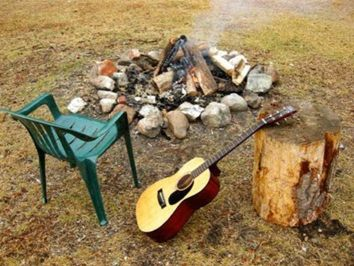

When I was young I immensely enjoyed singing campfire-style songs
during the evenings of the camps of my youth club, the NJN.
But I never learned to play the guitar.

Much much later I tried to sing the songs I loved, and I tried to 
play the guitar chords to the songs.
These files contain the campfire songs I collected in this attempt.
It is a forever work-in-progress, there is as yet no real unity in style or notation.
I am not a good guitar player, so I try to stick to the simple chords.

I am Dutch and from a previous generation, so there are lots old of Dutch songs.
But the bulk is (older) English, Scottish and especially Irish songs.
If you were a member of the NJN or ACJN you will find most songs from
the Barberje and Wiekel songbooks.

Files: songbook.docx is the real thing, 
attic.docx contains the stuff that is unfinished, 
template.docx can be used as base to add (and submit) a new song.

last update: 2021-08-21